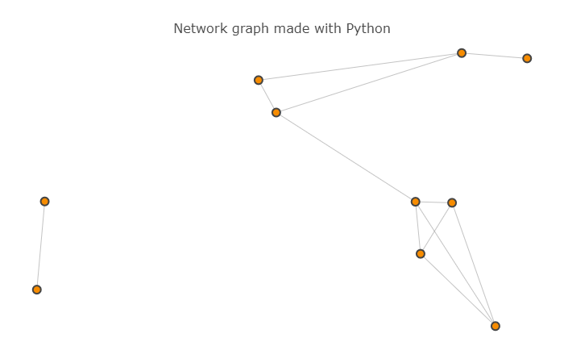
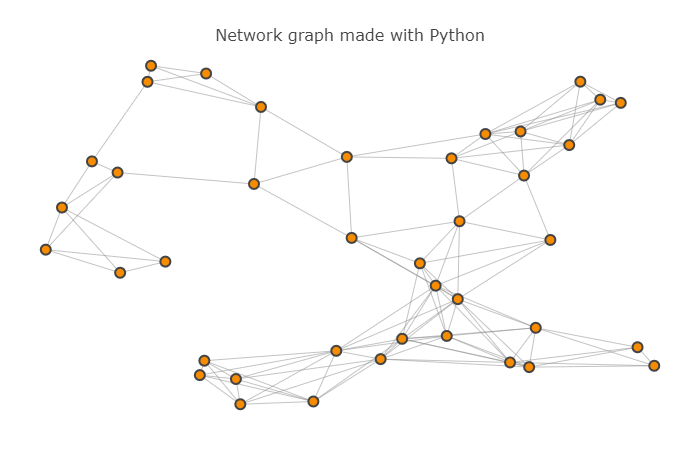

# Route_Planner

Building a route-planning algorithm like the one used in Google Maps to calculate the shortest path between two points on a map.

### Algorithm 

In this project, I've applied A* search to implement a "Google-maps" style route planning algorithm and find the shortest path between two points.

### This project includes the following files:

helpers.py - Contains helper functions for loading and displaying the maps.
map-10.pickle - Contains the map with 10 nodes.
map-40.pickle - Contains the map with 40 nodes.
project_notebook.ipynb - Jupyter notebook that contains all the instructions for the project
test.py - Contains function for testing the route planner implementation.

### Maps Used

